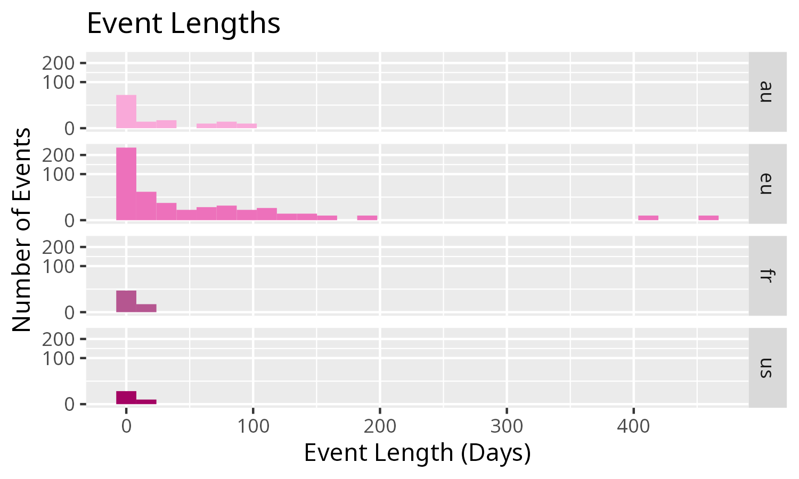
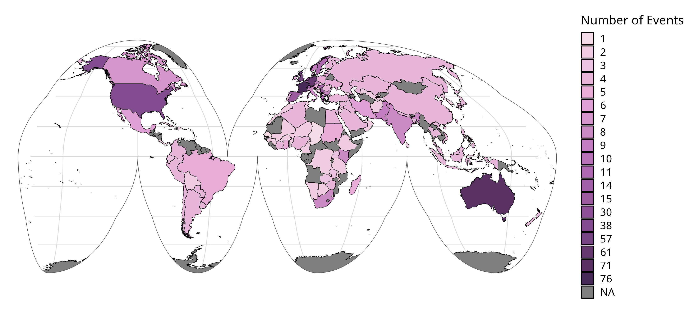

# TIaaS Paper Code & Data

The plot generating script is `plots.R`:

```
conda create -n tiaas -f environment.yaml
Rscript plots.R
```

The data is frozen ahead of publication due to the integration of Smörgåsbord data which was handled in a bit of a custom way.

- smorg-1.tsv and smorg-2.tsv were created based on the Registrations for the event
- The numbers.csv was created from the four APIs (see commented code in plots.R)
- The rows relating to Smörgåsbord were manually edited to include all relevant countries





